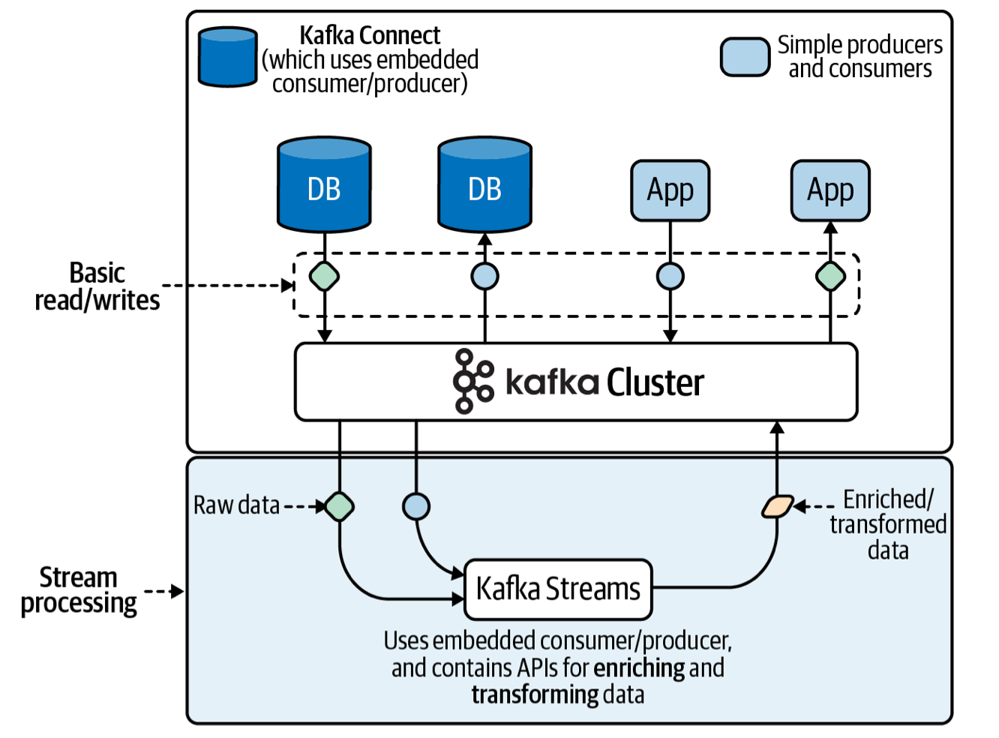
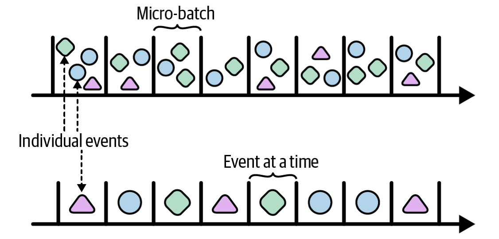
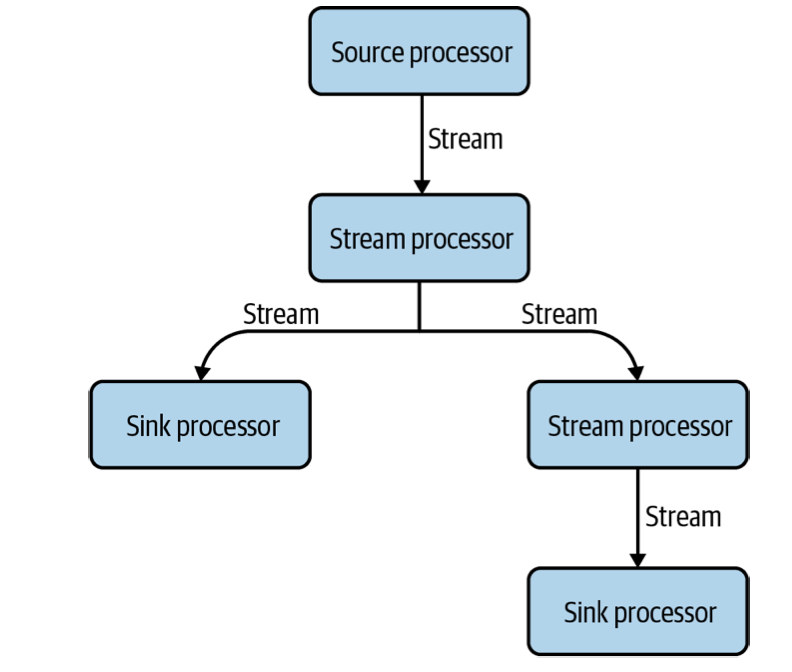
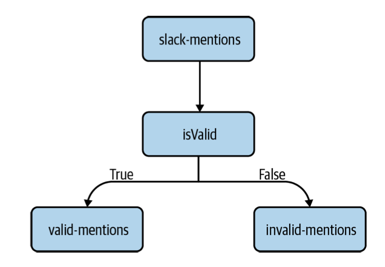
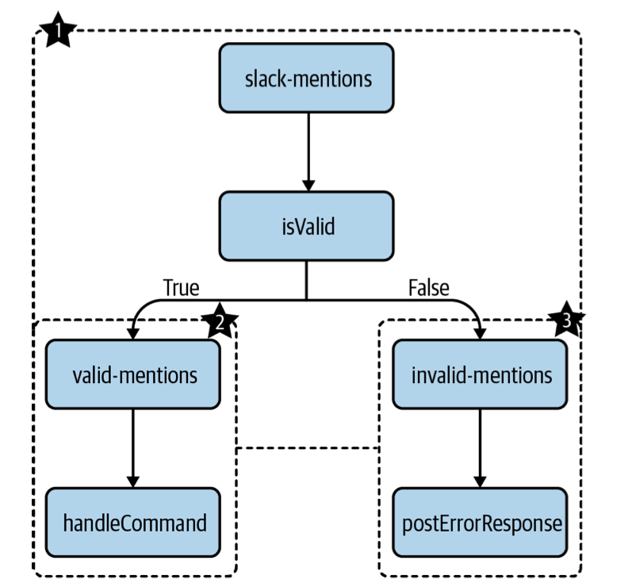
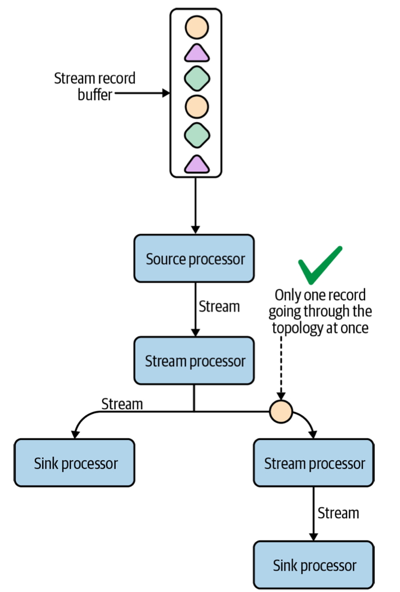
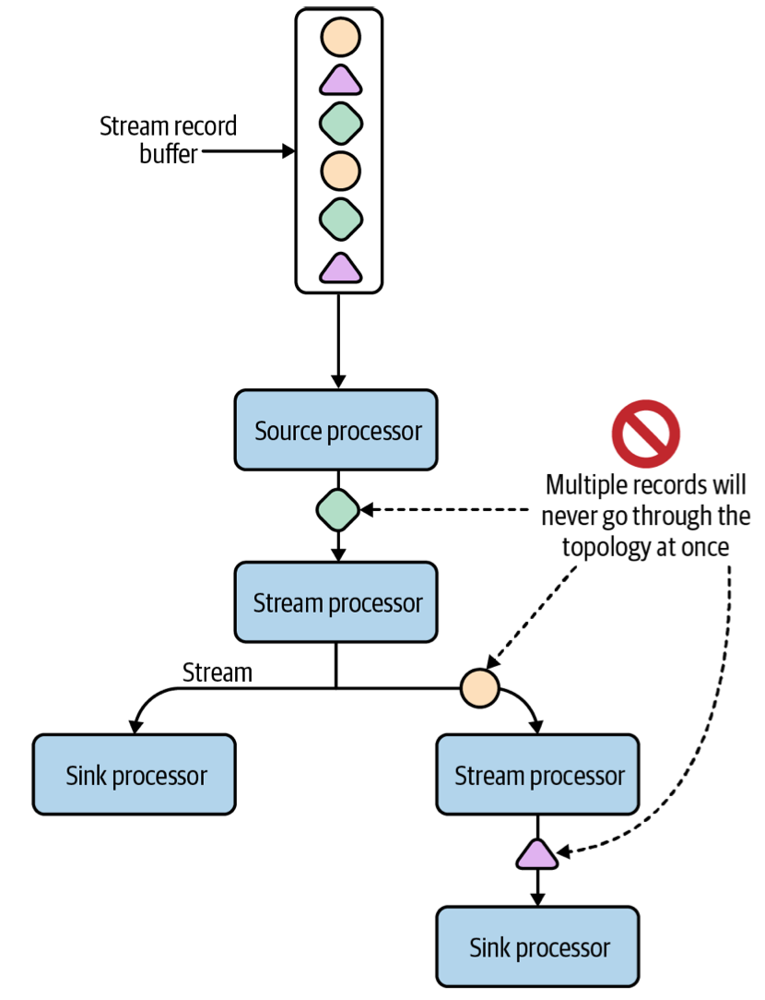

# Getting Started with Kafka Streams

## Before Kafka Streams

`Kafka Streams` 이전에는, 스트림 처리 어플리케이션을 만드는 것이 필요 이상으로 복잡했었다(데이터 처리에 대한 라이브러리 부족). 초창기 카프카 생태계에서, 카프카 기반 스트림 처리 어플리케이션을 만드는 데에는 두 가지 옵션이 있었다. 

- Producer/Consumer API를 사용해서 직접 구현
- `Spark Streaming`, `Flink`같은 다른 스트림 처리 프레임워크 사용

Producer/Consumer API를 직접 이용하는 방법은 API를 구현한 다양한 언어로 구현할 수 있고, 어떤 종류의 처리 로직이라도 직접 구현할 수 있다. 하지만 그 대가로 엄청난 양의 코드를 작성해야 한다.

- 스트림 처리 어플리케이션에 필요한 것들
    - Local and fault-tolerant state
    - A rich set of operators for transforming streams of data: aggregate, join, group events(window, bucket)...
    - More advanced representations of streams
    - Sophisticated handling of time

나머지 옵션으로 Spark Streaming, Flink 같은 완전한 스트림 처리 플랫폼을 사용하면, 플랫폼의 다양하고 풍부한 기능을 직접 구현하지 않고 사용할 수 있지만, 해당 자원을 관리하기 위해서 추가적인 복잡도를 감당해야 한다.

카프카 생태계에는 프로세싱 클러스터의 오버헤드 없이, 스트림 처리 요소를 제공하는 단순하고 성능이 좋은 솔루션이 필요했다. 

## Enter Kafka Streams

2016년에 Kafka Streams의 첫 버전이 릴리즈되면서 카프카 생태계에 큰 변화가 있었다. 수동적인 기능에 의존하던 기존 스트림 어플리케이션(API를 통해 직접 구현한 앱, 다른 스트림 처리 플랫폼)들은 카프카 커뮤니티가 개발한 패턴과 실시간 이벤트 스트림 처리를 위한 추상화를 활용한 고오급 어플리케이션(Kafka Streams App)으로 대체되었다.

Producer/Consumer, Connect API는 단순히 카프카에 데이터를 저장하거나 읽어오는 작업에 집중하는 반면, Kafka Streams는 실시간 스트림 처리에 초점을 둔다. 데이터 파이프라인을 따라 흐르는 이벤트 스트림을 쉽게 컨슘하고, 풍부한 스트림 처리 연잔자를 통해 데이터 변환 로직을 적용하고, 선택적으로 새로운 형태의 데이터를 카프카에 저장하는 기능을 지원한다.

 

## Features at a Glance

Kafka Streams는 현대의 스트림 처리 어플리케이션에 적합한 많은 기능을 지원한다.

- Java의 streaming API 와 유사한 high-level DSL
- 세심한 작업을 지원하는 low-level Processor API
- streams, table 같은 데이터 모델링을 위한 편리한 추상화
- streams, table 간 join 연산 지원
- stateless, stateful 스트림 처리를 위한 연산자와 유틸리티(ex: RocksDB)
- windowing, periodic 기능을 포함한 시간 기반 연산자
- 간단하고 쉬운 설치(단순한 라이브러리임)
- Scalability, Reliability, Maintainability 

## Operational Characteristics 

`Martin Kleppmann`의 `Designing Data-Intensive Applications`에서 저자는 데이터 시스템에서 세가지 중요한 목적을 강조한다.

- scalability 확장성
- Reliability 신뢰성
- Maintainability 유지보수성

### Scalability

부하가 증가하더라도 대처할 수 있고 성능을 유지할 수 있는 시스템을 `scalable`하다고 한다. 카프카 토픽은 파티션 개수를 늘리거나 브로커를 추가하는 방식으로 스케일링할 수 있다.

Kafka Streams에서는 한 파티션을 작업 단위로 처리하며, 컨슈머 그룹을 통해 자동으로 작업이 분산된다. 토픽이 파티션을 추가하는 방식으로 확장할 수 있는 것 처럼, Kafka Streams도 여러 인스턴스를 실행시켜서 확장할 수 있다.

Kafka Streams 어플리케이션은 대부분 다수의 인스턴스로 배포된다. 각 인스턴트는 컨슈머 그룹에 의해 전체 작업의 일부를 할당 받아 처리하게 된다. 만약 소스 토픽에 32개의 파티션이 있고 4개의 인스턴스를 실행시킨다면, 한 인스턴스당 8개의 파티션(8 * 4 = 32)을 처리한다. 인스턴스 개수를 늘려 16개를 실행시킨다면 각 인스턴스당 2개의 파티션(16 * 2 =32)을 처리한다.

### Reliablility

데이터 시스템에서 신뢰성은 엔지니어 관점(새벽에 서비스 장애로 일을 하고 싶지 않음)뿐만 아니라 고객의 관점(서비스를 이용할 수 없는 경우, 데이터 손실 등을 겪고 싶지 않음)에서도 중요한 요소이다. Kafka Streams에는 Consumer Groups을 통해 내결함성 기능을 갖는다. 

여러개의 인스턴스를 배포한 상황에서 장애로 한 개가 죽은 경우, 카프카는 자동으로 다른 인스턴스들에게 파티션을 재분배한다. 장애가 해결되고 다시 인스턴스가 실행되면(or k8s같은 시스템에 의해 새로 실행), 자동으로 카프카로부터 작업(파티션)을 할당받을 것이다.

### Maintainablility

Kafka Streams는 자바 라이브러리이기 때문에 버그수정이나 트러블슈팅이 비교적 쉽다. 또한 자바 어플리케이션을 모니터링하는 패턴(로그 수집 및 분석, JVM 성능 등)은 잘 확립되어 있다. 게다가 Kafka Streams API는 간결하고 직관적이기 때문에 code-level 유지보수가 비교적 쉽다.

## Comparison to Other Systems

### Deployment Model

Kafka Streams는 Spark Streaming, Flink같은 기술과 다른 배포 전략을 갖고 있다. 후자는 스트림 처리 프로그램을 실행하기 위해 각각 전용의 처리 클러스터를 구축해야 한다. 이것은 매우 큰 복잡도와 부담을 줄 수 있다. 잘 알려진 기업(Netflix)의 숙련된 엔지니어(Nitin Sharma) 조차 처리 클러스터의 오버헤드는 무시할 수 없다고 인정하고 있다. 

반면에 Kafka Streams 어플리케이션은 라이브러리를 통해 구현되는 standalone 어플리케이션이기 때문에 클러스터를 구축하지 않다고 된다. 또한 모니터링, 패키징, 배포하는 방법에 있어서 많은 자유도가 있다. 

### Processing Model

Spark Streaming, Trident의 처리 모델은 `micro-batching` 이다. micro-batching은 이벤트를 작은 그룹(batch)로 묶어서 메모리에 버퍼링하고 특정 주기마다 처리하는 방식이다.

Kafka Streams는 `event-at-a-time processing`(이벤트가 들어오는 즉시 처리)으로 구현되어서, micro-batching 보다 지연율이 낮다.

> micro-batching을 사용하는 프레임워크들은 보통 지연율이 높은 대신에 처리량에 최적화 되어있다. Kafka Streams에서는 파티션의 개수를 늘려서 데이터를 분할 처리하는 방식으로 낮은 지연율을 유지하면서 높은 처리량을 보장할 수 있다.

### Kappa Architecture

Kafka Streams와 다른 솔루션을 비교할 때 고려해야 하는 중요한 사항은 유즈케이스가 배치와 스트림 처리가 모두 필요한지 여부이다. Kafka Streams는 스트림 처리만 지원(Kappa Architecture)하는 반면, Spark Streaming, Flink는 배치와 스트림 처리 모두 지원(Lambda architecture)한다. 하지만 두 처리 모델을 모두 사용하는 것에 단점이 없는 것은 아니다. Jay Kreps는 Kafka Streams가 나오기 2년 전에 이미 하이브리드 시스템의 몇가지 단점에 대해 다음과 같이 말했었다.

> 두가지 시스템을 실행하고 디버깅하는 운영 부담은 시간이 갈수록 힘들어 질 것이다. 어떠한 새로운 추상화도 두 시스템을 모두 만족할 수 없다.

이러한 어려움속에서도 `Apache Beam`과 같은 프로젝트는 배치 및 스트림 처리를 위한 통합된 프로그래밍 모델을 정의했고, 최근 몇 년 동안 큰 인기를 누리고 있다. 하지만 Beam은 Flink와 같은 방식으로 Kafka Streams와 비교할 수 없다. Beam은 대부분의 작업을 실행 엔진에 의존하는 API 계층이다. 예를 들어 Spark와 Flink는 Beam의 실행 엔진으로 사용될 수 있다. 따라서 Kafka Streams와 Beam을 비요할 때는, Beam API 외에도 사용할 실행 엔진도 함께 고려해야 한다.

게다가 Beam 기반 파이프라인은 Kafka Streams가 제공하는 몇가지 중요한 기능을 지원하지 않는다. Robert Yokota(실험적인 Kafka Streams Beam Runner 프로젝트를 만든 사람)는 두 프레임워크를 비교하면서 다음과 같이 표현했다.

- Kafka Streams는 `stream-relational processing` 플랫폼이다.
- Apache Beam은 `stream-only processing` 플랫폼이다.

stream-relational 플랫폼은 stream-only 플랫폼에는 없는 몇가지 기능이 있다.

- relations는 first-class citizens이다. 즉 각 relation은 독립적인 식별정보를 갖고 있다.
- relations는 다른 relations로 바뀔 수 있다.
- relations는 특별한 방법으로 쿼리될 수 있다.

말은 복잡하지만 결국 Beam이나 다른 프레임워크에서 사용할 수 없는 기능(스트림의 상태를 쿼리하는 등)을 Kafka Streams는 제공한다는 뜻이다. 카파 아키텍처는 스트림 처리 작업을 위한 보다 간결하고 전문적인 접근 방식(개발 경험을 향상시키고 운영 및 유지보수를 단순화)을 제공한다. 따라서 만약 유즈케이스에 배치 작없이 필요하지 않다면, 람다 아키텍처는 불필요한 복잡성만 야기할 것이다. 

## Use Cases

Kafka Streams는 무한한 데이터셋을 빠르고 효율적으로 처리하는 데에 최적화되어 있다. 따라서 데이터가 즉시 처리되어야 하는(지연율이 낮아야 하는) 도메인의 솔루션으로 적합하다.

## Processor Topologies

Kafka Streams는 프로그램을 입력, 출력, 처리 단계로 표현하는 DFP(Dataflow Programming) 패더라임을 활용한다. 스트림 처리 로직은 일련의 단계로 표현하는 대신에 DAG(Directed Acyclic Graph)로 구조화한다. 

Kafka Streams에는 세가지 기본적인 프로세서가 있다.

- Source processors
    - 소스는 데이터가 어플리케이션으로 흘러들어오는 진입점이다. 카프카 토픽으로 부터 읽은 데이터는 하나 이상의 스트림 프로세서로 전달된다.
- Stream processors 
    - 이 프로세서들은 입력 스트림에 데이터 처리/변환 로직을 적용하는 역할을 한다. high-level DSL에서는, 라이브러리에 있는 내장 연산자(filter, map, flatMap, join 등)를 사용하여 정의된다.
- Sink processors
    - 싱크는 앞선 프로세서들에 의해 처리/변환된 데이터를 다시 카프카에 적제하는 역할을 한다. 소스와 같이, 싱크는 카프카 토픽과 연결되어 있다.

프로세서들의 집합은 `processor topology`(커뮤니티에서는 보통 간단하게 topology라 부름)를 형성한다. 앞으로 나올 예제들은 먼저 소스, 스트림, 싱크 프로세서로 연결된 토폴로지를 디자인한 뒤에, 자바 코드로 구현해볼 것이다.

개념 설명을 위해 하나의 시나리오를 가정해보자. Kafka Streams를 이용해서 Slack 챗봇을 만들어야 한다. 챗봇을 언급하는 `@StreamsBot` 키워드가 포함된 모든 슬랙 메시지가 저장된 slack-mentions 토픽이 있다. 챗봇을 언급하는 모든 메시지에는 @StreamsBot 뒤에 특정한 명령어가 오길 기대한다.(ex: @StreamsBot restart myservice)

먼저 슬랙 메시지가 옳바른 형식(명령어)인지 검증하는 토폴로지를 정의해야 한다. (1) slack-mentions 토픽에서 데이터를 읽어오고, (2) 메시지 형식이 유효한지 검증한 후, (3) 유효한 메시지라면 valid-mentions 토픽에, 그렇지 않다면 invalid-mentions 토픽에 저장하는 로직이다.

### Sub Topologies

Kafka Streams에는 sub-topologies 개념이있다. 앞선 슬랙 챗봇 예제에서는 소스 토픽이 한 개였지만, 만약 다수의 소스 토픽을 읽어야 하는 경우가 있을 수 있다. 이런 경우 Kafka Streams는 토폴로지를 하위 토폴로지로 나눠 작업을 병렬화한다. 한 입력 스트림(isValid-true 스트림)에 대한 작업은 다른 입력 스트림(isValid-false 스트림)에 대한 작업과 독립적으로 실행될 수 있기 때문에 이러한 분할이 가능하다.

계속해서 슬랙 챗봇을 만들어보자. 기존 토폴로지에서 valid-mentions 토픽을 읽어 명령문을 처리하는 스트림 프로세서와 invalid-mentions 토픽을 읽어 에러 응답을 보내는 스트림 프로세서를 추가한다. 

이제 전체 토폴로지에서는 세가지 토픽(slack-mentions, valid-mentions, invalid-mentions)에서 데이터를 읽어온다. Kafka Streams는 새로운 소스 토픽에서 데이터를 읽을 때마다, 해당 영역을 하위 토폴로지(독립적으로 실행할 수 있는 영역)로 분할한다.

1번 하위 토폴로지에서 valid-mentions와 invalid-mentions는 싱크 프로세서로 동작하고 2, 3번 하위 토폴로지에서는 소스 프로세서로 동작한다. 이러한 경우 3개의 하위 토폴로지 간에는 직접적인 데이터 교환이 일어나지 않는다. 데이터는 싱크 프로세서를 통해 카프카에 쓰이고, 소스 프로세서를 통해 카프카로부터 다시 읽어온다. 

### Depth First Processing

Kafka Streams는 데이터를 처리할 때 depth-first 전략을 사용한다. 한 데이터가 토폴로지를 모두 순회해서 처리가 끝날 때까지, 다른 데이터는 토폴로지에 진입하지 않는다.  

깊이 우선 전략은 데이터 흐름을 추론하는 것을 쉽게 만들어주지만, 스트림 프로세서의 연산이 느리다면 동일한 스레드에서 처리될 다음 데이터 처리를 지연시킬 수 있다. 

> 다수의 sub-topologies가 실행중이라면, single-event 규칙은 전체 토폴로지에 적용되지 않고, 각 sub-topologies에 적용된다. 

### Benefits of Dataflow Programming

### Tasks and Stream Threads

## High Level DSL Versus Low Level Processor API