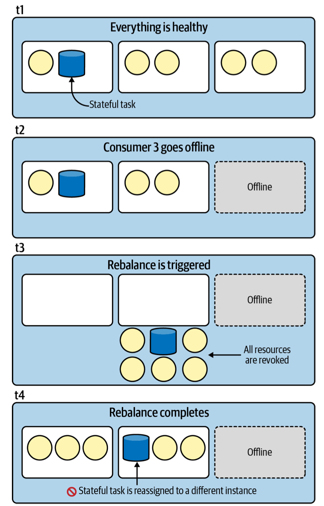
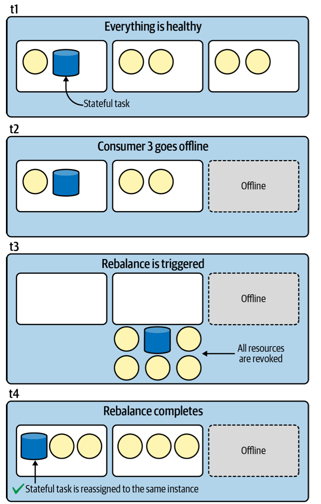
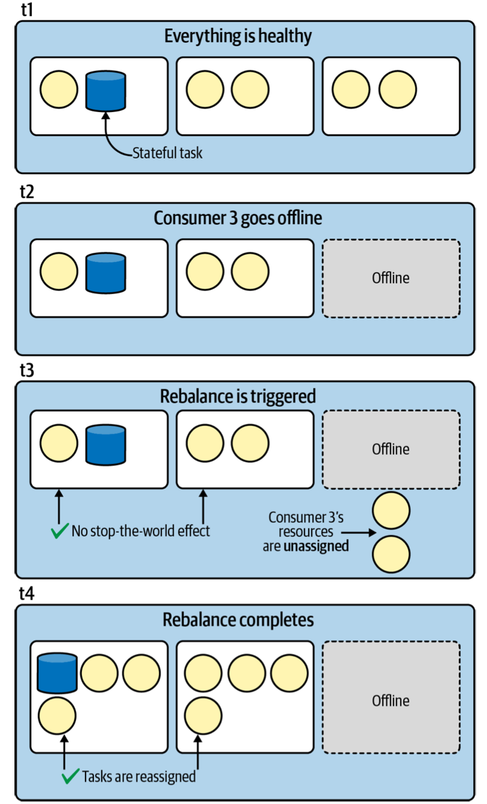
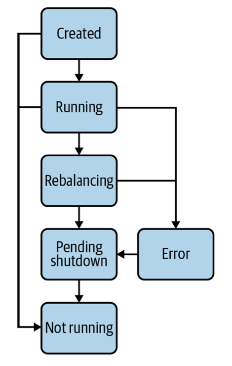

# Advanced State Management

## Persistent Store Disk Layout


## Fault Tolerance


### Changelog Topics


### Standby Replica


## Rebalancing: Enemy of the State

changelog topics는 어플리케이션이 state를 잃었을 때 다시 복구할 수 있도록 하고, standby replicas는 state를 복구하는 시간을 감출 수 있게 한다. 

하지만 Kafka Streams에 장애 내구성이 있다 하더라도, state store를 잃는 것이 아주 치명적이라는 사실은 변하지 않는다. 만약 복구해야 하는 state의 크기가 큰 경우, 토픽을 읽고 다시 적제하는 데에 수 분에서 극단적인 경우 수 시간까지 걸릴 수 있다. 

state를 복구해야 하는 상황의 가장 큰 원인은 파티션 재할당이다. 카프카는 컨슈머 멤버쉽에 변화가 있으면 자동으로 파티션을 재분배 한다. 이때 파티션 재할당은 크게 두가지 요소에 의해 이뤄진다. 

- group coordinator: 카프카 브로커에서 담당하며, 컨슈머 그룹의 멤버쉽을 관리(heartbeats 수신, 멤버쉽 변경을 감지하고 재할당 프로세스를 트리거)한다.
- group leader: 카프카 컨슈머에서 담당하며, 어떤 컨슈머에 어떤 파티션을 할당할 지를 담당한다. 

Kafka Streams에서는 파티션 재할당 이슈를 다루기 위해 두가지 전략을 사용한다.

- 가능하다면 state store가 다른 인스턴스로 옮겨지는 것을 막는다. -> 파티션 할당 변경을 최소화한다.
- 불가피하게 state store를 다른 인스턴스에 복구해야 하는 경우, 최대한 빨리 이뤄지도록 한다. -> state store의 크기를 최대한 작게 유지한다.
 
 
## Preventing State Migration

stateful tasks(파티션)가 다른 인스턴스로 재할당되면 tasks에 관련된 state store 또한 해당 인스턴스로 이동해야 한다. changelog를 읽어 state를 복구하는 비용은 크기에 따라 아주 비쌀 수 있기 때문에, 최대한 피하는 것이 좋다.

앞서 살펴본대로 `group leader`는 컨슈머들에게 작업을 분배하는 역할을 한다. Kafka Streams는 이러한 분배 작업 로직을 새로 구현해서 불필요한 파티션 재분배를 방지한다. 

### Sticky Assignment

Kafka Streams는 task를 소유했던 인스턴스가 파티션 재할당 이후에도 그대로 해당 task를 소유할 수 있도록 분배한다. 이 커스텀 전략을 `sticky assignment`라 한다.  

다음은 기본 재할당 전략에 따라 task가 분배되는 과정을 나타낸 그림이다. 컨슈머의 기본 재할당 전략을 사용하면, stateful task가 파티션 재할당 후 다른 인스턴스로 이동될 가능성이 있다.

> 예시는 eager rebalancing 프로토콜을 따른다.



sticky partition assignor는 stateful task가 어떤 인스턴스에 속해있는지를 추적하고, 재할당 이전에 속해 있던 인스턴스에 그대로 해당 task를 할당한다.  




### Static Membership

`rolloing update` 같은 의도된 중단이 일어났을 때, 파티션이 재할당 되는 것은 옳지 않다. 카프카는 `static membership`을 통해 group coordinator가 컨슈머의 중단을 짧은 시간동안 허용하도록 할 수 있다. 해당 시간동안은 컨슈머가 heartbeat를 보내지 않아도 재할당을 하지 않는다. 

> `session.timeout.ms` 동안 잠깐 중지되는 경우 불필요한 재할당을 피할 수 있지만, 실제로 중단된 경우 해당 시간만큼 멤버쉽 변경을 늦게 감지하여 lag가 커질 수 있다.

[자세한 내용](../../kafka-the-definitive-guide/ch4-kafka-consumers#Static-Group-Membership)

## Reducing the Impacts of Rebalances


### Incremental Cooperative Rebalancing


[자세한 내용](../../kafka-the-definitive-guide/ch4-kafka-consumers#Consumer-Groups-and-Partition-Rebalance)



### Controlling State Size

유즈케이스에 따라 다르겠지만, 보통 데이터에는 생명 주기가 있기 때문에 어플리케이션은 state의 전체를 항상 유지하고 있을 필요가 없다. 더이상 추적하지 않아도 되는 데이터는 제거함으로서 state store를 최소한으로 유지할 수 있고, 재할당의 영향도 효과적으로 줄일 수 있다. stateful tasks가 다른 인스턴스로 이동해야 하는 경우, 큰 state 한 개 보다는 작은 state 여러개를 옮기는 것이 더 쉽다.

#### Tombstones

`tombstones`는 `delete markers`라고도 불리며, 삭제되어야 하는 상태를 나타내는 특별한 record이다. tombstones record는 value를 null로 설정하여 state store에서 삭제되어야 하는 상태를 나타낸다.

```java
StreamsBuilder builder = new StreamsBuilder();
KStream<byte[], String> stream = builder.stream("patient-events");

stream
    .groupByKey()
    .reduce(
        (value1, value2) -> {
          if (value2.equals(PATIENT_CHECKED_OUT)) {
            // tombstone을 생성하기 위해 null을 반환한다. 
            return null;
        }
        
        return doSomething(value1, value2);
    }); 
```

#### Window retention

`windowed stores`는 `withRetention`을 통해 retention period를 지정할 수 있다. windowed stores는 지정된 기간동안의 records만 유지하므로 state stores를 작게 유지할 수 있다. 

```java
TimeWindows tumblingWindow =   
    TimeWindows.of(Duration.ofSeconds(60)).grace(Duration.ofSeconds(5));

KTable<Windowed<String>, Long> pulseCounts =   
    pulseEvents
        .groupByKey()
        .windowedBy(tumblingWindow)
        .count(
            Materialized
            .<String, Long, WindowStore<Bytes, byte[]>>as("pulse-counts")
            // 최근 6시간 동안의 데이터들만 유지함.
            .withRetention(Duration.ofHours(6)))
        .suppress(
            Suppressed.untilWindowCloses(BufferConfig.unbounded().shutDownWhenFull())); 
```

> retention time은 window size와 grace period의 합보다 커야 한다.

#### Aggressive topic compaction

앞선 tombstones, withRetention은 state stores를 작게 유지해서 재할당 영향을 줄이는 방법이었다. `aggressive topic compaction`은 changelog topics를 작게 해서 재할당 영향을 줄이는 방법이다.

changlog topics는 기본적으로 압축 전략을 사용한다. 그렇기 때문에 각 key에 대한 최신 value 값만 유지한다. 

하지만 state store에서 압축, 삭제를 하더라도, 기반에 있는 topic에는 바로 반영되지 않고 일정 기간동안 오래된 값과 tombstones를 유지한다. 이러한 현상의 이유는 브로커와 클라이언트 간의 Topic 추상화에 있다. 클라이언트에서의 topic의 최소 단위는 partition인 반면에, 브로커에서의 topic의 최소 단위는 `segment`이다. 

segment는 topic partition의 메시지를 저장하는 파일이다. 현재 파티션의 메시지가 쓰이고 있는 segment를 active segment 라고 한다. active segment는 특정 크기에 도달하거나, 특정 시간이 지나면 inactive segment가 된다. 카프카 브로커는 오직 inactive segment만 압축할 수 있다.

active segment에 있는 records는 압축할 수 없기 때문에, state stores를 복구해야 할 때, 많은 양의 오래된 값이나 tombstones를 읽게될 수 있다. 게다가 기본적으로 `log cleaner`는 이미 50% 이상 압축/삭제되어 있는 경우 더이상 로그의 크기를 줄이려 하지 않는다. active segment가 inactive segment가 되는 빈도나 최대 압축률은 설정 가능하다. 성능 튜닝을 위해 값을 설정할 수 있다.

|Configuration|Default|Definition|
|:-----------:|:-----:|:--------:|
|segment.bytes|1073741824 (1 GB)|segment 최대 크기|
|segment.ms|604800000 (7 days)|segment 최대 생명 주기|
|min.cleanable.dirty.ratio|0.5|최대 압축률|
|max.compaction.lag.ms|Long.MAX_VALUE - 1| |
|min.compaction.lag.ms|0| |

```java
Map<String, String> topicConfigs = new HashMap<>();
// segment의 크기를 512 MB로 설정
topicConfigs.put("segment.bytes", "536870912");
// 30% 이상 압축하지 않음
topicConfigs.put("min.cleanable.dirty.ratio", "0.3");

KTable<byte[], Long> counts =
    stream
        .groupByKey()
        .count(
            Materialized.<byte[], Long, KeyValueStore<Bytes, byte[]>>as("counts")
                .withKeySerde(Serdes.ByteArray())
                .withValueSerde(Serdes.Long())
                .withLoggingEnabled(topicConfigs));

```

## State Store Monitoring

### Adding State Listeners

Kafka Streams 어플리케이션은 `Created`, `Running`, `Rebalancing`, `Pending shutdown`, `Not runngin` 상태를 갖는다. 



파티션 재할당은 Stateful Kafka Streams 어플리케이션에 특히 큰 영향을 주기 때문에, 어플리케이션이 언제, 얼마나 자주 재할당 상태가 되는지 모니터링하는 것이 중요하다. Kafka Streams는 상태가 변경될 때 호출될 callback을 등록할 수 있도록 `State Listener`를 제공한다.

```java
streams.setStateListener(
    (oldState, newState) -> {
      if (newState.equals(State.REBALANCING)) {
        // do something
      }
    });
``` 

### Adding State Resotre Listeners

Kafka Streams는 state store가 파티션 재할당에 의해 다시 초기화될 때 호출될 `State Restore Listener`를 제공한다. 

```java
KafkaStreams streams = new KafkaStreams(...);

streams.setGlobalStateRestoreListener(new RestoreListenerImpl()); 


// StateRestoreListener 인터페이스를 구현.
// onRestoreStart, onRestoreEnd, onBatchRestored 3가지 메소드를 구현해야 함.
class RestoreListenerImpl implements StateRestoreListener {

  private static final Logger log =
      LoggerFactory.getLogger(RestoreListenerImpl.class);
  
  // startingOffset이 0이라면, 전체 상태를 다시 초기화 해야하는 상황을 나타냄.
  @Override
  public void onRestoreStart(
      TopicPartition topicPartition,
      String storeName,
      long startingOffset,
      long endingOffset) {
    log.info("The following state store is being restored: {}", storeName);
  }
  
  @Override
  public void onRestoreEnd(
      TopicPartition topicPartition,
      String storeName,
      long totalRestored) {
    log.info("Restore complete for the following state store: {}", storeName);
  }
  
  // 이 callback method는 매우 빈번하게 호출될 수 있기 때문에, 동기적 연산을 사용하면 성능에 영향이 있을 수 있음.
  // 로깅하는 것조차 매우 부담스러울 수 있기 때문에, 일반적으로는 비워둠.
  @Override
  public void onBatchRestored(
      TopicPartition topicPartition,
      String storeName,
      long batchEndOffset,
      long numRestored) {
  }
} 
```

## Interactive Queries

Kafka Streams 2.5 버전 이전까지는, 어플리케이션이 죽거나 파티션 재할당 이슈가 발생하면, 해당 어플리케이션에 대한 interactive queries 요청은 실패했다. `rolling update`같은 상황에서 조차 가용성 이슈가 있었기 때문에, 고가용성을 요구하는 마이크로서비스를 구축하는 데에 있어서 큰 어려움이 있었다. 

```java
KeyQueryMetadata metadata =
  streams.queryMetadataForKey(storeName, key, Serdes.String().serializer());

String remoteHost = metadata.activeHost().host(); // 해당 호스트가 재할당 상태라면 요청은 실패함.
int remotePort = metadata.activeHost().port();
```

2.5 버전 이후부터는, standby replicas가 interactive queries 요청을 처리할 수 있게 되었다. 이를 통해 Kafka Streams 어플리케이션이 재할당 상태일 때도 고가용성의 API를 제공할 수 있게 되었다. 

```java
KeyQueryMetadata metadata =
    streams.queryMetadataForKey(storeName, key, Serdes.String().serializer());

// isAlive는 StateListeners를 통해 직접 구현해야 함.
if (isAlive(metadata.activeHost())) {
  // activeHost로 요청.
} else {
  // activeHost가 요청을 처리할 수 없는 상태라면
  // standby replicas로 요청.
  Set<HostInfo> standbys = metadata.standbyHosts();
}
```


## Custom State Stores