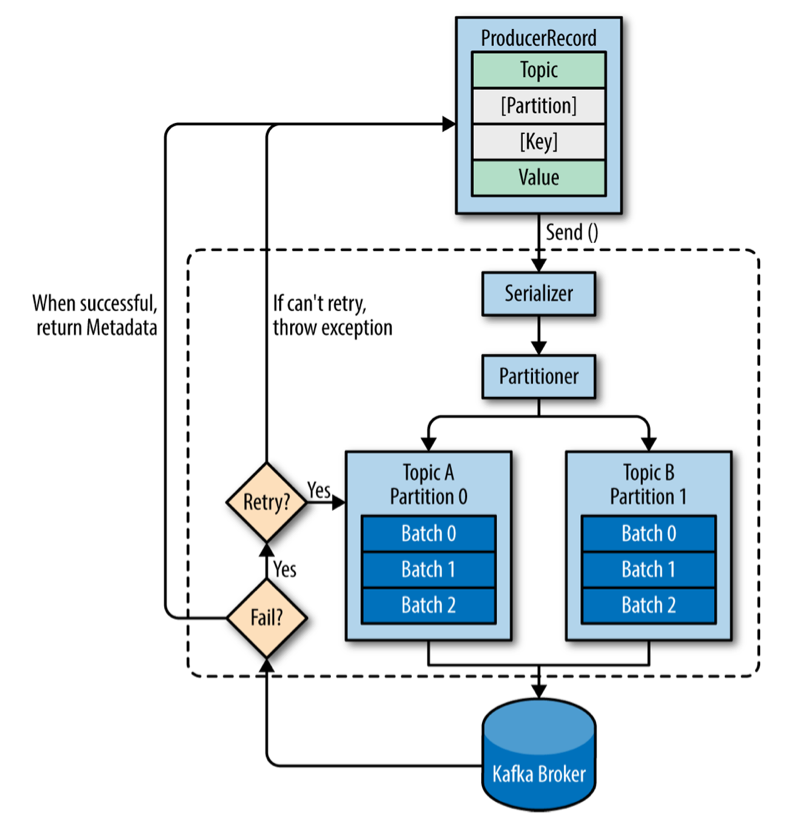

# Kafka Producers: Wirting Messages to Kafka

## Producer Overview

어플래케이션이 kafka에 데이터를 쓰는 상황은 다양하다. 

- 사용자 활동을 기록해서 분석
- metrics를 기록하거나
- 로그 메시지들을 저장
- 어플리케이션 간 비동기 통신을 지원
- 데이터베이스에 쓸 정보 버퍼링
- 등등..

이러한 usecase들은 각각 다른 요구사항이 있다. 

- 모든 메시지들이 아주 중요함. 유실되면 안됨. vs 어느정도의 유실은 넘어가도 됨.
- 메시지의 중복이 허용되는지?
- 엄격한 지연율, 처리량이 요구되는지?

신용카드 거래를 예시로 들어보자. 거래 정보는 아주 중요하기 때문에 유실되어선 안되고,  또한 중복도 있어선 안된다. 지연율은 낮아야 하지만 500ms 까지는 허용할 수 있고, 처리량은 초당 100만 건을 처리할 만큼 높아야 한다.

사용자의 click 정보를 저장하는 경우, 몇몇의 메시지들은 유실되거나 중복되어도 상관없다. 지연율은 UX에 지장이 가지 않는 한 높아도 된다. 처리량은 예상되는 웹사이트의 활동량에 달려있다.

각각의 다른 요구사항들은 producer의 설정과 API를 사용하는 방법에 영향을 미친다. 

다음 그림은 kafka producer의 대략적인 구성이다.



kafka에 메시지를 보내기 위해서 먼저 ProducerRecord를 만들어야 한다. 여기서 topic와 value는 필수, key와 partition은 선택이다. 

ProducerRecord를 전송하면 먼저 key와 value를 byte array로 직렬화해서 네트워크로 전송할 수 있게 한다.

이후 partitioner에 의해 key를 기준으로 파티션이 특정된다. 만약 ProducerRecord에서 partition을 명시했다면 해당 파티션을 사용한다. 

분류된 데이터들은 kakfa brokers로 전달되기 전에 배치를 위한 버퍼에 임시 저장된다. 배치는 토픽과 파티션이 같은 데이터끼리 관리된다. producer의 main thread와 분리된 별개의 thread가 각 배치들을 적절한 broker로 전송한다.

broker가 메시지를 받으면 응답을 보낸다. 성공에 대한 응답이라면 토픽, 파티션, 오프셋에 대한 정보를 담은 RecordMetadata를 전달한다. 만약 broker가 메시지 저장에 실패했다면 에러를 반환한다. producer가 에러를 응답받으면 바로 에러를 반환하기 전에 몇번정도 메시지 전송을 재시도한다.

## Constructing a Kafka Producer

producer 객체는 properties를 통해 생성한다. kafka producer는 필수적인 속성이 있다.

- bootstrap.servers
    - 카프카 클러스터에 처음 연결을 맺기 위한 브로커들의 "host:port" 쌍 리스트이다. 
    - 처음 연결을 맺은 후엔 클러스터에 대한 정보를 얻기 때문에, 모든 브로커의 정보를 쓸 필요는 없다. 
    - 하지만 특정 브로커가 죽어도 안정적으로 클러스터에 연결하기 위해서 최소 2개의 브로커 정보를 사용하는 것을 권장한다.
    
- key.serializer
    - 데이터를 카프카에 보내기 전에 key를 직렬화할 때 사용될 클래스의 이름이다.
    - kafka broker는 byte array로 된 key와 value를 받는다. 하지만 producer API는 파라미터로 모든 객체를 받을 수 있다. 이러한 인터페이스는 가독성을 높이지만, producer에게 해당 객체를 byte array로 변환할 방법을 알려줘야 한다. key.serializer에는 "org.apache.kafka.common.serialization.Serializer" 인터페이스의 구현체의 이름을 설정해야 한다. 
    - kafka client 패키지는 ByteArraySerializer, StringSerializer, IntegerSerializer 등의 기본적인 타입에 대한 Serializer를 제공한다. 
    - ProducerRecord에 value만 사용하려 해도 key.serializer를 설정해야 한다.

- value.serializer
    - key.serializer와 동일한 역할이다. value를 byte array로 변활할 클래스의 이름을 설정한다.
    
```java
Properties kafkaProps = new Properties();

kafkaProps.put("bootstrap.servers", "broker1:9092,broker2:9092");
kafkaProps.put("key.serializer",     "org.apache.kafka.common.serialization.StringSerializer"); 
kafkaProps.put("value.serializer","org.apache.kafka.common.serialization.StringSerializer");

producer = new KafkaProducer<String, String>(kafkProps);
```

producer 인스턴스를 생성했으니 이제 메시지를 보내보자. 메시지를 전송하는 데에는 3가지 주요한 정책이 있다.

- Fire-and-forget
    - 메시지를 서버로 전송하고 이후에 성공하던지 실패하던지 신경쓰지 않는 것이다.
    - kafka는 고가용성이고 producer는 실패한 메시지를 자동으로 재전송하기 때문에, 대부분 성공적으로 전달될 것이다. 
    - 하지만 재시도할 수 없는 에러와 timeout의 경우 메시지들은 유실된다. 이때 어플리케이션은 유실에 대한 정보나 exception을 전달받을 수 없다.

- Synchronous send
    - send() 메소드는 "Java Future Object"를 반환한다. 해당 객체의 get() 메소드를 사용해서 해당 요청이 성공했는지 아닌지 결과를 기다릴 수 있다.

- Asynchronous send
    - callback function을 담아서 send() 메소드를 호출한다. broker로부터 응답을 받았을 때 콜백이 트리거된다.

예시코드에는 싱글 스레드로 메시지를 보내지만 멀티 스레드로 데이터를 전솔할 수 있다.

## Sending a Message to Kafka

```java
ProducerRecord<String, String> record =
        new ProducerRecord<>("CustomerCountry", "Precision Products", "France");
        
try {   
    producer.send(record); 
} catch (Exception e) {
    e.printStackTrace();
} 
```

메시지를 broker로 전송하는 과정이나 broker에서 발생하는 에러들은 모두 무시할 수 있지만, 메시지 전송 전에 발생할 수 있는 exception들이 있다. 

- SerializationException : 메시지 직렬화에 실패했을 때 
- BufferExhaustedException & TimeoutException : 버퍼가 꽉 찼을 때 
- InterruptException : 배치 전송을 담당하는 스레드가 인터럽트 상태일 때

### Sending a Message Synchronously

이 방법도 간단하지만 broker가 요청에 대한 error를 응답하거나, 재전송 시도가 만료되었을 때 exception이 발생할 수 있다.

주요한 tradeoff는 성능이다. kafka cluster가 얼마나 바쁜지에 따라, 응답은 대략 2ms에서 몇s 정도 걸린다. 메시지를 동기적으로 보내면 해당 요청에 대한 응답을 받을 때까지 해당 스레드는 블럭된다. 추가적인 메시지를 보내지도 않는다. 이 방법은 아주 처참한 성능을 보이기 때문에 상용 어플리케이션에서는 사용하지 않는다.

```java
ProducerRecord<String, String> record =
        new ProducerRecord<>("CustomerCountry", "Precision Products", "France"); 
        
try {
    producer.send(record).get();
} catch (Exception e) {
    e.printStackTrace();
}

```

Future.get() 에서 kafka의 응답을 기다린다. 응답이 실패라면 해당 메소드에서 exception을 던진다. 응답이 성공이라면 RecordMetadata 객체를 받는다.

KafkaProducer는 2가지 타입의 에러가 있다. "Retriable errors"는 메시지를 재전송함으로서 해결할 수 있는 에러들이다. 커넥션 오류인 "not leader for partition" 에러는 해당 파티션에 새로운 리더가 선출되고 클라이언트에 새로운 메타데이터가 생신되면 해결되는 문제이다. KafkaProducer는 이러한 에러에 대해 자동으로 재시도를 하기 때문에, 어플리케이션 코드는 재시도 횟수가 만료된 에러와 "non-retriable errors"에 대한 exception만 처리하면 된다. "non-retriable errors"에는 "message size too large" 같은 에러가 포함된다.

### Sending a Message Asynchronously

대부분의 경우, 전송에 성공한 메시지에 대한 Metadata 정보를 전달받을 필요가 없다. 반면에 메시지 전송에 실패했을 때, 우리는 어플리케이션에 exception을 던지거나, 로깅하거나 파일에 기록해야 하기 때문에 해당 경우를 다루는 것은 중요하다.

메시지를 비동기로 전송하면서 에러에 대한 처리를 하려면 callback을 활용해야 한다. 

```java
private class DemoProducerCallback implements Callback {
    @Override
    public void onCompletion(RecordMetadata recordMetadata, Exception e) {      
        if (e != null) {
            e.printStackTrace();         
        }     
    } 
}

ProducerRecord<String, String> record =
        new ProducerRecord<>("CustomerCountry", "Biomedical Materials", "USA");
        
producer.send(record, new DemoProducerCallback()); 
```

> Warning : 콜백은 producer의 main thread에서 실행된다. 이것은 콜백의 실행 시간이 꽤 빨라야 함을 의미한다. 콜백의 실행이 복잡할 경우 다른 메시지 전송이 지연될 수 있다. 만약 콜백에서 blocking operation(file I/O...)을 수행해야 한다면 다른 thread에서 동시적으로 수행하는 것을 권장한다.
    

## Configuring Producers

KafkaProducer는 설정값들이 아주 많다. 대부분의 설정값들은 적절한 기본값을 갖고있기 때문에, 모든 값들을 하나하나 설정할 필요는 없다. 하지만 몇몇 설정값들은 메모리 사용량, 성능, 신뢰성 부분에서 상당한 영향을 준다.

### client.id

클라이언트 어플리케이션에 논리적인 식별자를 부여한다. String 값으로 설정하며, broker에서 메시지가 어떤 클라이언트로 부터 왔는 지를 식별할 때 사용한다. 적절한 식별자를 사용하면 troubleshooting이 매우 쉬워진다.

### acks

### Message Delivery Time

### buffer.memory

producer가 borker로 메시지를 전달하기 전에 보관하는 배치 버퍼의 크기를 지정한다. 서버에 전송할 수 있는 속도보다 앱에서 메시지를 생성하는 속도가 더 빠르다면, 버퍼가 꽉 차게되고 추가적인 send() 호출은 블락된다. 해당 스레드는 버퍼가 비는 것을 기다리다가 timeout이 만료되면 exception을 던지게된다.

### compression.type

기본적으로 메시지들은 압축하지 않고 전송된다. 압축을 활성화 함으로써, 보통 메시지를 전송할 때 발생하는 bottlenect인 네트워크와 저장공간 사용량을 줄일 수 있다. 파라미터는 "snappy", "gzip", "lz4", "zstd" 이 있다. 

snappy는 구글이 만든 압축 알고리즘으로, 준수한 압축률과 낮은 CPU overhead, 좋은 성능을 보여준다. 성능과 대역폭 모두 고려해야 할 경우 추천된다.

gzip은 CPU를 더 많이 사용하지만 더 좋은 압축률을 보여준다. 따라서 네트워크 대역폭이 더 제한된 상황에서 추천된다. 

### max.in.flight.requests.per.connection

producer가 broker의 응답을 받지 않고 얼마나 많은 메시지를 보낼 수 있는지를 설정한다. 값을 높게 설정할 수록, 메모리 사용량이 증가하고 처리량이 증가한다. 하지만 너무 높게 설정하면 배치 처리 효율이 나빠져서 처리량이 감소한다. 

1 로 설정하면 메시지 재전송이 발생하더라도 어플리케이션이 전송하려 한 메시지 순서가 보장된다.

> Ordering Guarantees : "retries > 0" & "max.in.flight.requests.per.connection > 1"일 때, 첫번째 배치가 실패하고 두번째 배치가 성공한다면 메시지들의 순서가 보장되지 않는다. 보통 retries를 0으로 설정하는 것은 비합리적이다. 따라서 순서 보장이 중요한 경우, inflight를 1으로 설정해서 배치 전송이 재시도되는 동안 추가적인 메시지가 전송되지 않도록 하는 것이 좋다. 이 설정은 producer 처리량을 제한하기 때문에 순서가 중요한 경우에만 사용해야 한다. 

### receive.buffer.bytes & send.buffer.bytes

### enable.idempotence

kafka version 0.11 부터 "exatly once"를 지원한다. 

producer의 acks를 all으로, delivery.timeout을 적절히 크게 세팅해서 신뢰도를 최대로 설정했다고 가정해보자. 대부분 메시지가


