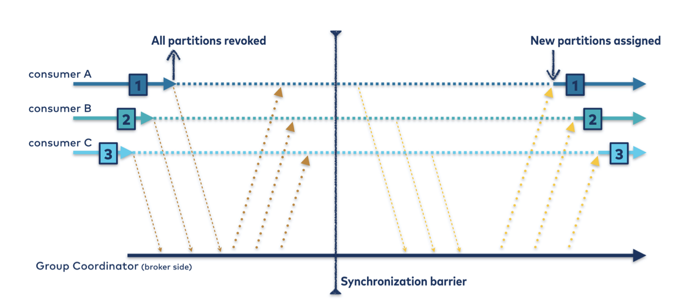
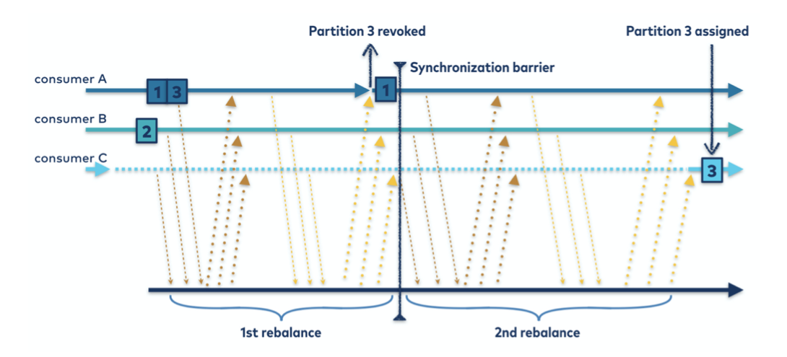

# Chapter 4. Kafka Consumers: Reading Data from Kafka

## Kafka Consumer Concepts

### Consumers and Consumer Groups

### Consumer Groups and Partition Rebalance

한 그룹 내의 consumer들은 topic의 partitions의 소유권을 공유한다. 그룹에 새로운 consumer가 추가되면, 이전에 다른 consumer가 담당하던 partitions을 새로운 consumer가 받아서 처리한다. 같은 방법으로 그룹 내에 충돌이나 중지로 인해 한 consumer가 중단되면, 해당 consumer가 담당하던 partitions는 남아있는 consumers 중 하나에서 받아 이어서 처리한다. 파티션 재할당은 해당 그룹이 처리하는 topic이 변경(topic에 partition 추가 -> partition 개수 변동)될 때도 발생한다. 

파티션의 소유권이 한 consumer에서 다른 consumer로 이동하는 것을 재할당이라고 한다. 재할당은 consumer group의 고가용성과 확장성에 큰 영향을 미치는 동작이다. 재할당 동작은 파티션 할당 전략에 따라 2가지 방식이 있다.

- Eager Rebalances
    - 재할당이 진행될 동안, 모든 consumers가 동작을 멈추고, 모든 paritions에 대한 소유권을 포기한 후, 그룹 내에서 완전히 새로운 파티션 소유권을 갖는다.
    

- Cooperative Rebalances 
    - 파티션 소유권에 변동이 있는 consumer group의 부분 집합만 재할당에 참여한다.
    - 재할당에 참여하지 않는 consumer들은 계속해서 데이터를 처리할 수 있다.
    - Cooperative는 두 맥락을 통해 진행된다.
        - 1. consumer group leader가 재할당되어야 하는 파티션을 소유하고 있는 consumer 들에게 해당 정보를 알린다. 정보를 받은 consumer들은 해당 파티션에 대한 작동을 멈추고 소유권을 포기한다.
        - 2. consumer group leader가 버려진 파티션들을 새로운 소유자들에게 배분한다.
    - 이 과정은 파티션이 안정적으로 할당될 때까지 여러번 반복될 수 있다.
    - 이 방식의 장점은 그룹 내의 모든 consumer들이 작동을 멈추는 상황을 피할 수 있다는 것이다. 그룹의 규모가 아주 큰 경우, Eager 정책을 사용하면 상당한 시간동안 모든 데이터 처리가 멈출 수 있다.   
    >

### Static Group Membership

기본적으로 comsumer group의 구성원으로서의 comsumer 식별 정보는 일시적이다. consumer가 group을 떠나서 파티션 할당 정보가 제거된 뒤에 다시 참가하면, consumer는 재할당 정책에 따라 새로운 member ID, 새로운 파티션 셋을 할당받는다.

`group.instance.id` 설정을 통해 consumer를 그룹의 정적 멤버로 생성할 수 있다. consumer가 정적 멤버로 그룹에 처음 참가하면, 일반적인 경우처럼 파티션 할당 정책에 따라 특정 자원을 할당받는다. 하지만 정적 멤버 consumer가 정지된 경우, 해당 consumer의 session timeout이 만료될 때까지 자동으로 그룹에서 제거되지 않는다. consumer가 다시 group에 참가하면 이전에 할당받았던 파티션 셋을 그대로 할당받는다.

`group.instance.id`는 같은 그룹 내에서 고유해야 한다. 한 그룹에서 두 consumer가 같은 정적 멤버 ID로 참가할 경우, 두번째 consumer는 ID 중복 에러가 난다.

할당된 파티션에 의해 생성된 local state or cache를 사용하는 어플리케이션이라면 정적 멤버 그룹이 유용하다. 컨슈머가 재시작될 때마다 이러한 상태 정보를 다시 생성해야하는 상황을 피할 수 있다. 하지만 컨슈머가 소유한 파티션들은 해당 컨슈머가 재시작될 때까지 재할당되지 않는 다는 것을 고려해야 한다. 일정기간동안 해당 파티션 셋의 데이터들은 소비되지 않고 큰 lag를 만들 수 있다. 이 전략을 사용하는 경우, consumer가 재시작된 이후 쌓여있는 lag를 충분히 따라잡을 수 있는 처리량을 보장해야 한다.

정적 맴버 그룹에서 consumer가 정말로 제거되었는지 판단하는 `session.timeout.ms` 설정값은 신중하게 결정해야 한다. 어플리케이션 재시작이 간단하다면 파티션 재할당을 피하기 위해 충분히 큰 값을 설정해야 하고, downtime이 상당한 경우엔 큰 lag를 피하기 위해 작은 값을 설정해야 한다.

## Creating a Kafka Consumer

`bootstrap.servers`, `key.deserializer`, `value.deserializer` 설정은 필수적이다. `group.id` 설정은 필수는 아니지만, group을 설정하지 않고 생성하는 경우는 드물다.

## Subscribing to Topics

토픽은 한개 이상의 토픽을 지정할 수 있다. 또한 정규식을 통해 지정할 수도 있다.

> Warning: 최소 2.6 버전까지는 구독할 토픽들의 필터링이 컨슈머쪽에서 이뤄진다. 만약 토픽을 특정한 목록으로 지정하지 않고 정규식으로 지정한 경우, 컨슈머는 모든 토픽 & 파티션에 대한 metadate 정보를 정기적으로 브로커에 요청하게 된다. 만약 컨슈머, 토픽, 파티션이 많은 상태에서 정규식을 사용한다면, 브로커와 클라이언트와 네트워크에 큰 부하를 줄 수 있다. 

## The Poll Loop

consumer의 메인은 다음 코드와 같은 간단한 반복문이다.

```java
Duration timeout = Duration.ofMillis(100);

while (true) {
    ConsumerRecords<String, String> records = consumer.poll(timeout); // 1
    
    for (ConsumerRecord<String, String> recode : records) { // 2
        // processe record
    } 
}
```

consumer는 poll() 호출을 멈추면 안된다. 만약 poll()를 보내지 않는다면, consumer group은 해당 consumer가 죽은 것으로 판단하고 담당하고 있던 파티션들을 재할당해버린다. poll()의 전달인자는 timeout 간격이다. 이 값은 컨슈머 버퍼안에 있는 데이터(records)를 바로 사용할 수 없을 때 얼마나 block될 지를 결정한다. 만약 timeout 값이 0이거나 records를 바로 사용할 수 있다면, poll()은 records를 바로 반환한다. 반대의 경우라면 해당 시간만큼 기다린다.   

poll()은 단순히 데이터를 가져오는 것 이외에 많은 일을 한다. 새로 생성된 consumer가 처음 poll()을 호출하면, `GroupCoordinator`를 찾고, consumer group에 참가하고, 파티션을 할당받는다.  만약 그룹내에서 파티션 재할당이 일어난다면, poll()  이 이를 처리한다. 이외에 여러가지 상황에 맞는 콜백들을 처리한다. 컨슈머에서 일어날 수 있는 거의 모든 에러들과 콜백들은 poll()이 던지는 exception을 통해 알 수 있다.

`max.poll.interval.ms` 설정값 이내에 poll()을 호출하지 않으면 해당 컨슈머는 죽은 것으로 판단되고 그룹에서 쫒아낸다. 따라서 poll loop 내에서는 예측할 수 없는 block을 피해야 한다.

> Thread Safety: 한 쓰레드에 한 컨슈머가 국룰이다. 한 어플리케이션에서 같은 그룹의 여러 컨슈머를 실행시키려면, 각각의 쓰레드에서 실행해야 한다. 다른 접근 방식으로, 한 컨슈머가 이벤트를 polling하고 여러 워커 쓰레드에서 데이터를 가져가 처리하는 방법이 있다.

> Warning: 오래된 버전의 kakfa에서는 poll의 시그니쳐가 `poll(long)`이었지만, 현재는 deprecated 되었고 `poll(Duration)`으로 변경됐다. 단순히 시그니처만 바뀐 것이 아니라 내부 동작이 약간 변경됐다. 이전 메소드는 필요한 metadata가 있다면, timeout이 지나더라도 정보를 얻을 때까지 block 된다. 새로운 메소드는 컨슘할 데이터가 없다면 block 되지 않고 바로 반환한다. 만약 이전 버전에서 단지 metadata를 얻기위한 강제적인 방법으로 `poll(0)`을 사용했다면, 최신 버전에선 같은 동작을 기대할 수 없다. 대체할 방법은 `rebalanceListener.onPartitionAssignment()`를 사용하는 것이다. 

## Configuring Consumers

대부분의 설정들은 적절한 기본값으로 셋팅되어있어서 그대로 사용해도 상관 없다. 하지만 consumer의 성능과 가용성에 영향을 주는 몇가지 중요한 설정이 있다.

### fetch.min.bytes

### fetch.max.wait.ms

### fetch.max.bytes

### max.poll.records

### max.partition.fetch.bytes

### session.timeout.ms & heartbeat.interval.ms

### max.poll.interval.ms

### default.api.timeout.ms

### request.timeout.ms

### auto.offset.reset

### enable.auto.commit

### partition.assignment.strategy

### client.id

### client.rack

### group.instance.id

### receive.buffer.bytes & send.buffer.bytes

### offset.retention.minutes


## Commits and Offsets

rebalancing 중에 메시지가 누락되거나 중복 처리되는 가능성을 제거하려면, 오프셋이 커밋되는 타이밍을 제어해야 한다. consumer API는 개발자들을 위해 오프셋 커밋 방법에 대한 옵션을 제공한다.

`enable.auto.commit=false`로 설정하면 오프셋은 어플리케이션이 명시적으로 지정할 때만 커밋된다.

가장 간단하고 명확한 commit API는 `commitSync()`이다. 이 API는 `poll()`을 통해 반환된 records의 마지막 오프셋을 커밋한다. 따라서 메시지가 누락되는 상황을 피하려면 `poll()`에서 반환된 records를 모두 처리한 이후에 `commitSync()`를 호출해야 한다. rebalance가 발생하면, 가장 최근의 배치부터 재할당 시간까지의 모든 메시지들이 중복 처리된다.

다음은 `commitSync()`의 예시이다.

```java
Duration timeout = Duration.ofMillis(100);

while (true) {
    ConsumerRecords<String, String> records = consumer.poll(timeout);
    
    for (ConsumerRecord<String, String> recode : records) {
        // processe record
    } 
    
    // poll()에서 반환된 배치의 모든 records를 처리한 이후, 다음 배치를 가져오기 전에 commitSync() 호출
    try {
        consumer.commitSync();
    } catch (CommitFailedException e) {
        // commitSync()는 회복될 수 없는 에러가 발생하지 않는한, 내부적으로 계속 재시도함. 
        // 만약 해당 에러가 발생했다면, 로그를 남기는 것 이외에는 할 수 있는 것이 없음.
        log.error("commit failed", e);
    }
}
```


### Asynchronous Commit

`commitSync()`의 한가지 단점은 카프카 브로커로 부터 오프셋 커밋 요청에 대한 응답이 오기 전까지 어플리케이션이 block 되는 것이다. 오프셋 커밋은 덜 자주할 수록 처리량은 높아지지만, rebalance 시에 중복 처리될 수 있는 메시지 개수가 증가한다.

다른 옵션은 `commitAsync()` 이다. 이 API는 브로커의 커밋 요청에 대한 응답을 기다리지 않고, 단순히 커밋 요청만 보낸다.


```java
Duration timeout = Duration.ofMillis(100);

while (true) {
    ConsumerRecords<String, String> records = consumer.poll(timeout);
    
    for (ConsumerRecord<String, String> recode : records) {
        // processe record
    } 
    
    // 오프셋 커밋 요청만 보낼 뿐, block되지 않는다.
    // commitAsync()는 commitSync()처럼 요청이 실패해도 커밋 요청을 재시도하지 않는다. 
    // 다음 배치 처리 이후의 호출에서 성공하길 기대한다.
    consumer.commitAsync();
}
```

콜백을 통해 재시도 로직을 전달할 수도 있다.

```java
consumer.commitAsync(new OffsetCommitCallback() {
    public void onComplete(Map<TopicPartition, OffsetAndMetadata> offset, Exception e) {
        // retry logic
    }
});
```

> Retrying Async Commits: 비동기적인 재시도에서 옳바른 커밋 순서를 보장하는 간단한 패턴은 시퀀스 넘버를 이용하는 것이다. 매번 커밋할 때마다 commitAsync 콜백에 시퀀스 넘버를 전달한다. 콜백은 시퀀스 넘버를 통해 이미 다음 배치를 통해 새로운 커밋 요청이 성공했는지, 아니면 재시도 요청을 보내도 될지 판단할 수 있다.

### Combining Synchronous and Asynchronous Commits

일반적으로, 간간히 실패하는 커밋 요청은 일시적이고 다음 배치의 커밋 요청에서 성공할 것이기 떄문에, 재시도하지 않다고 큰 문제가 없다. 하지만 consumer를 중지시키기 전이나 rebalance 하기 전과 같은 경우, 최근까지 처리한 오프셋을 명시적으로 커밋시키고 싶을 것이다.

일반적인 패턴은 commitAsync를 사용하다가 중지 직전 commitSync를 호출하는 것이다. 

다음은 rebalance listensers를 사용하지 않고 구현한 코드이다.

```java
Duration timeout = Duration.ofMillis(100);

try {
    while (true) {
        ConsumerRecords<String, String> records = consumer.poll(timeout);
    
        for (ConsumerRecord<String, String> recode : records) {
            // processe record
        } 
    
        consumer.commitAsync();
    } 
} catch (Exception e) {
    log.error("Unexpected error", e);
} finally {
    try {
        consumer.commitSync();
    } finally {
        consumer.close();
    } 
}

```

### Commit Specified Offset

앞선 커밋 API들은 보통 polling 배치를 모두 처리한 이후에 호출하도록 강제한다. 하지만 `poll()`이 너무 큰 배치를 반환해서, 해당 배치를 처리하는 도중에 오프셋 커밋을 하고 싶다면 어떻게 해야 할까? `commitSync()`와 `commitAsync()`는 배치의 마지막 오프셋을 커밋하기 때문에 사용할 수 없다.

다행이도, commitSync와 commitAsync에 인자를 전달해서 특정 오프셋을 커밋할 수 있다. 

```
private Map<TopicPartition, OffsetAndMetadata> currentOffsets = new HashMap<>();
int count = 0;

// ...

while (true) {
    ConsumerRecords<String, String> records = consumer.poll(timeout);
    
    for (ConsumerRecord<String, String> recode : records) {
        // processe record
        
        // 컨슈머는 한 개 이상의 파티션을 컨슘할 수 있기 때문에 모든 record들의 오프셋을 추적해야 한다.
        currentOffsets.put(
            new TopicPartition(record.topic(), record.partition()), 
            new OffsetAndMetadata(record.offset()+1, "no metadata")
         );
        
        if (count % 1000 == 0)
            consumer.commitAsync(currentOffsets, null);
        count++; 
    } 
}
``` 

## Rebalance Listeners


## Consuming Records with Specific Offsets


