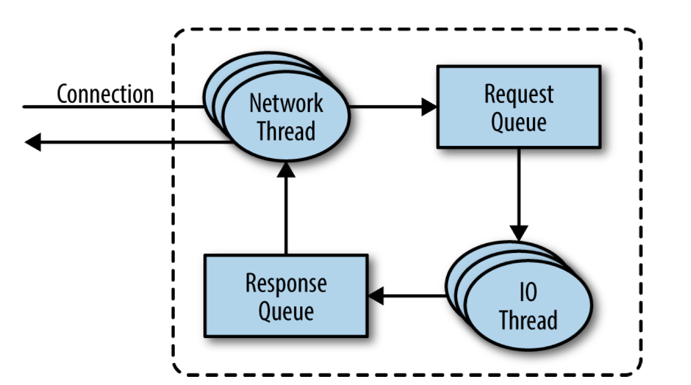
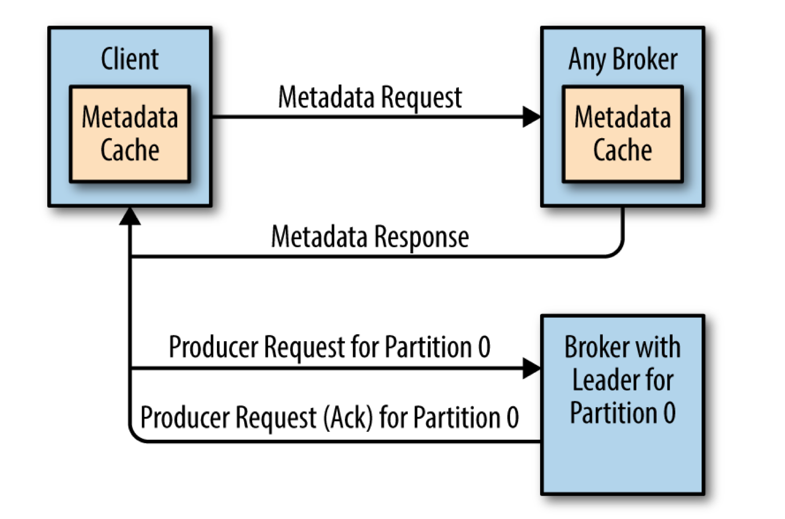

# Chapter 6. Kafka Internals

카프카를 실행하거나 카프카를 사용하는 어플리케이션(Producer, Consumer)를 작성하기 위해서 카프카 내부 구현을 꼭 이해할 필요는 없다. 하지만 트러블슈팅을 해야할 때, 카프카가 왜 그런식으로 작동하는지 이해해야 할 때는 필요할 것이다. 모든 세부구현이나 내부 디자인을 살펴보는 것은 이 책의 범위를 넘어서기 때문에, 입문자를 위한 몇가지 주제만 살펴볼 것이다.

- Kafka Controller
- How Kafka replication works
- How Kafka handles requests form producers and consumers
- How Kafka handles storage such as file format and indexes

이 주제들을 이해하면 카프카를 튜닝할 때 특히 유용할 것이다.  

## Cluster Membership

카프카는 클러스터를 구성하는 브로커 목록을 관리하기 위해 `Apache Zookeeper`를 이용한다. 모든 카프카 브로커들은 설정 파일에 지정되거나 자동으로 생성된 고유 식별자 ID를 갖고있다. 카프카 브로커 프로세스가 시작되면 자신의 ID를 등록하기 위해 주키퍼에 `ephemeral node`를 생성한다. 다른 브로커들은 주키퍼의 `/brokers/ids` 경로(고유 ID를 등록하는 경로)를 subscribe 하기 때문에, 언제 브로커들이 추가되고 삭제되는지 알 수 있다.

브로커가 주키퍼와의 커넥션을 잃으면(보통 브로커가 중지되거나, 네트워크 파티션이 생기거나, 가비지 컬렉션에 의해 발생함), 주키퍼에서 ID가 저장된 ephemeral node가 삭제된다. 다른 브로커들은 동일한 방법으로 해당 브로커가 클러스터에서 떠났는지 알 수 있다.

특정 브로커가 중지되서 ephemeral node가 제거되어도, 그 브로커의 ID는 replica 목록같은 자료구조에 계속해서 존재한다. 만약 이전 브로커가 완전 사라지고 새로운 브로커가 같은 ID로 시작하면, 즉시 이전 브로커를 대체하면서(같은 토픽, 파티션을 할당받음) 클러스터에 참가하게 된다.

## The Controller

`Controller`는 일반적인 브로커의 기능을 수행하면서, 추가적으로 파티션 리더 선출을 담당하는 브로커이다. 클러스터에 참가한 첫 브로커는 주키퍼의 `/controller` 경로에 ephemeral node를 생성하면서 컨트롤러가 된다. 클러스터에 참가하려는 다른 브로커들도 마찬가지로 컨트롤러가 되기 위해 임시 노드를 생성하지만, `node already exists` 예외 처리를 통해 클러스터 내에 이미 컨트롤러가 있다는 것을 인지한다. 컨트롤러가 되지 못한 나머지 브로커들은 컨트롤러 임시 노드의 변경을 감지하기 위해 `Zookeeper watch`를 생성한다. 이를 통해 클러스터 내에서 오직 한 컨트롤러만 존재할 수 있게 된다.

기존 컨트롤러에 장애가 발생해서 임시 노드가 사라지면, 다른 브로커들은 자체적으로 주키퍼의 컨트롤러 경로에 임시 노드 생성을 시도한다. 주키퍼에 첫번째로 생성 요청을 보낸 브로커가 새로운 컨트롤러가 되고, 다른 컨트롤러는 새로 생성된 컨트롤러 임시 노드에 Zookeeper watch를 새로 생성한다. 

 컨트롤러가 새로 선출될 때마다, 컨트롤러는 주키퍼로 부터 생성된 임시 노드에 대한 새로운(이전보다 큰 값인) `epoch number`를 전달받는다. 브로커들은 현재 컨트롤러의 epoch number를 알고 있고, 만약 오래된 epoch number의 메시지를 받으면 해당 메시지를 무시한다. 이러한 동작이 중요한 이유는 오래된 컨트롤러와 새로운 컨트롤러가 동시에 존재할 수 있기 때문이다. 기존 컨트롤러가 긴 가비지 컬렉션에 의해 주키퍼와의 연결이 끊기면(`zookeeper.session.timeout.ms`동안 heartsbeat를 못보내게 된다면), 새로운 컨트롤러가 선출될 것이다. 이전 컨트롤러가 카비지 컬렉션을 끝내고 다시 시작하면, 중지된 동안 새로운 컨트롤러가 선출됐는지 모르고 계속해서 다른 브로커들에게 메시지를 보낼 수 있다. 이러한 오래된 컨트롤러를 좀비로 취급한다. 
 
새로 선출된 컨트롤러는 클러스터의 메타데이터를 관리하고 파티션 리더 선출을 수행하기 전에, 주키퍼로 부터 최신 replica 상태 정보를 읽어야 한다. 해당 작업은 읽기 요청의 지연 시간을 감추기 위해 비동기 API를 사용한다. 하지만 그럼에도 클러스터에 파티션 개수가 너무 많으면, 로딩 프로세스가 수 초가 걸릴 수 있다.  

클러스터에서 브로커가 떠나면, 컨트롤러는 해당 브로커가 리더로 있던 파티션들에 대해 새로 리더를 선출해야 한다. 컨트롤러는 먼저 (1) 새로운 리더가 필요한 파티션들을 살펴보고 새로 리더가 될 브로커를 결정한다. 다음으로 (2) 주키퍼에 새로운 상태 정보를 저장한다(지연시간을 줄이기 위해 비동기로 이뤄짐). 마지막으로 (3) 해당 파티션들에 대한 replicas를 포함하는 브로커들에게 파티션에 대한 새로운 리더와 팔로워 정보가 담긴 `LeaderAndISR` 메시지를 보낸다.

### KRaft - Kafka's new Raft based controller

2019년에 카프카 커뮤니티는 주키퍼 기반 컨트롤러에서 Raft 분산 합의 알고리즘 기반 컨트롤러로 전환하는 야심찬 프로젝트를 시작했다. KRaft의 preview 버전은 Apache Kafka 2.8 release에 포함되어 있다. Apache Kafka 3.0 release에서 주키퍼 기반 컨트롤러와 함께 동작할 수 있는 KRaft의 첫 상용 버전을 공개했다. 

왜 카프카 커뮤니티는 주키퍼 기반 컨트롤러를 대채하려 했을까? 카프카의 기존 컨트롤러는 이미 여러번 재작성 된 이력이 있다. 하지만 토픽, 파티션, 레플리카 정보를 저장하기 위한 주키퍼 사용 방법을 개선했음에도 불구하고, 기존 모델의 한계(파티션 개수 확장)가 더 명확해졌다. 몇몇 알려져 있던 문제점들이 변화의 동기가 되었다.

- 메타데이터 갱신은 주키퍼에 동기적으로 저장되지만, 브로커는 이 요청을 비동기로 보낸다. 게다가 주키퍼에서의 업데이트 정보를 비동기로 받는다. 이러한 동작들이 브로커, 컨트롤러, 주키퍼 사이에 메타데이터가 일치하지 않는 엣지 케이스를 만든다. 이러한 케이스는 탐지하기 너무 힘들다.
- 컨트롤러가 재시작할 때마다, 주키퍼로부터 모든 메타데이터 정보를 읽어와야 한다. 또한 읽어온 메타데이터를 다른 브로커들에게 전달해야 한다. 수년간의 노력에도 불구하고, 이 문제점은 주요한 bottleneck으로 남아있었다. 브로커가 늘어나고, 파티션이 확장되고, 컨트롤러가 재시작될때마다 카프카는 느려졌다.
- 메타데이터 소유권에 대한 내부 구현이 별로였다. 어떤 동작은 컨트롤러를 거쳐, 다른 동작은 브로커를 거쳐, 또다른 동작은 주키퍼를 통해 이뤄졌다.
- 주키퍼는 그 자체로 카프카와 같은 분산 시스템이다. 주키퍼를 위한 전문적인 작업이 추가적으로 필요하다. 

기존의 아키텍처에서 주키퍼는 두가지 중요한 기능을 담당했다. (1) 컨트롤러 선출, (2) 클러스터 메타데이터(브로커, 컨트롤러, 토픽, 파티션, 레플리카 정보)  저장. 새로운 Raft 기반 컨트롤러는 이러한 모든 기능을 대체해야 했다.

새로운 컨트롤러 디자인의 코어 아이디어는 카프카가 그 자체로 사용자에게 이벤트 스트림을 제공하는 로그 기반 아키텍처라는 것이다. 카프카의 로그는 이벤트들 사이에 명확한 순서를 보장하고, 컨슈머들이 항상 하나의 타임라인을 따라 이동하도록 한다. 새로운 컨트롤러 아키텍처는 메타데이터를 관리하기 위해 이러한 장점을 가져왔다.

새로운 아키텍처에서, 컨트롤러 노드들은 메타데이터 이벤트의 로그를 관리하는 Raft quorum 이다. 로그는 각각의 메타데이터 변경 정보를 담는다. 주키퍼에 저장됬던 모든 정보(토픽, 파티션, ISRs, 설정 등)은 로그로 저장된다.

컨트롤러 노드들은 다른 외부 시스템에 의존하지 않고 그들 사이에서 리더를 선출한다. 메타데이터 로그의 리더는 `active controller`로 부른다. active controller는 브로커들로 부터의 모든 RPC들을 처리한다. `follower controller`들은 active controller에 쓰이는 데이터들을 복제하고, 언제든지 active controller가 될 수 있도록 대기(hot standbys)한다. follower controller들은 active의 최신 상태를 계속 복제하기 때문에 상태가 active로 변경되어도 기존 설정 정보를 reloading 할 필요가 없다.

컨트롤러가 다른 브로커들에게 업데이트 정보를 pushing 하는 대신에, 브로커들은 새로운 `MetadataFetch API`를 사용해서 active controller로 부터 업데이트 정보를 가져온다. 이때 가져온 메타데이터 로그의 오프셋을 추적하고, 다음 fetch 요청에선 해당 오프셋으로부터 새로운 로그들만 가져온다. 브로커들은 컨트롤러로부터 가져온 메타데이터를 자신들의 디스크에 저장한다. 이를 통해 브로커는 수백만 개의 파티션이 있어도 빠르게 재시작할 수 있다.

새로운 컨트롤러 아키텍처에 대한 전반적인 디자인은 `KIP-500` 에 있다. 카프카에 어떻게 Raft 프로토콜을 적용시킬지에 대한 자세한 디자인은 `KIP-595` 에 있다. 새로운 컨트롤러, 클러스터 메타데이터와 상호작용할 새로운 CLI에 대한 자세한 디자인은 `KIP-631` 에 있다.

## Replication

복제는 카프카 아키넥처의 핵심이다. 복제는 카프카의 가용성과 내구성을 보장하는 가장 중요한 역할을 한다. 

카프카에서 데이터는 토픽을 통해 관리된다. 각 토픽은 파티션으로 이뤄져 있고, 각 파티션은 여러개의 레플리카를 가질 수 있다. 레플리카는 브로커에 저장되고, 각 브로커는 일반적으로 여러 토픽, 파티션에 걸쳐있는 수백, 수천개의 레플리카를 저장한다. 레플리카는 2가지 유형이 있다.

- Leader replica: 각 파티션엔 리더로 지정된 한 개의 레플리카가 있다. 일관성을 보장하기 위해, 모든 produce request들은 리더 레플리카를 통해 처리된다. 컨슈머는 리더와 팔로워들에서 모두 컨슘할 수 있다.

> Note: 팔로워 레플리카에서 읽기 기능은 KIP-392 에서 추가되었다. 클라이언트들이 무작정 리더만 찾는 것보다, ISR(in-sync-replica)를 이용함으로 인해서 네트워크 부하를 줄이는 것이 목적었다. 이 기능을 사용하기 위해서, 컨슈머는 자신의 위치를 특정하는 `client.rack` 설정값을 지정해야 한다. 마찬가지로 브로커는 `replica.selector.class`를 지정해야 한다. 이 설정의 기본값은 컨슈머들이 항상 리더만 사용하게 하는 `LeaderSelector`이다. `RackAwareReplicaSelector`를 사용하면 컨슈머는 자신의 `client.rack`과 일치하는 브로커(`rack.id`)에 있는 레플리카를 찾아간다. `ReplicaSelector` 인터페이스를 직접 구현하여 커스텀 로직을 사용할 수도 있다.    

> Note: 복제 프로토콜은 팔로워 읽기에서 신뢰성을 보장하기 위해, 커밋(과반수 이상 복제)된 메시지만 팔로워에서 읽힐 수 있도록 확장됐다. 이 기능을 제공하기 위해서, 모든 레플리카는 리더에서 커밋된 메시지 위치를 알아야 한다. 리더는 팔로워로 복제 메시지를 보낼 때, 현재의 high water mark(latest committed offset)를 포함시킨다. 리더에서 읽을 수 있는 데이터의 오프셋은 팔로워의 오프셋보다 빠르다. 읽기 지연 시간을 줄이고 싶다면 리더에서만 읽으면 된다(네트워크 부하 <-> 읽기 지연 시간 trade off). 

- Follower replica: 리더가 아닌 모든 레플리카들은 팔로워 레플리카이다. 팔로워는 리더의 메시지를 복제하는 일만 한다. 파티션의 리더 레플리카가 죽으면, 팔로워 레플리카 중에 하나가 리더로 승격된다.

리더 레플리카가 담당하는 또다른 작업은 팔로워들의 복제 상태를 추적하는 것이다. 팔로워는 리더로부터 받은 데이터들을 복제해서 최신 상태를 유지하려 노력하지만, 네트워크 정제로 인해 복제 속도가 느려지거나, 브로커가 재시작하는 등의 이유로 인해서 뒤쳐질 수 있다.

팔로워 레플리카들은 리더의 데이터를 복제하기 위해, 컨슈머가 데이터를 읽기 위해 보내는 요청과 완전히 동일한 방식으로 리더에게 Fetch 요청을 보낸다. Fetch 요청에는 팔로워 레플리카가 다음으로 복제해야 하는 메시지의 오프셋 정보를 담고있다. 

Fetch 요청에선 오프셋 순서가 보장된다. 레플리카가 메시지 1, 2, 3을 요청한 상태에서, 앞선 모든 메시지를 받기 전까지는 메시지 4를 요청하지 않는다. 따라서 리더 입장에서 팔로워가 메시지 4를 요청했다면, 그 팔로워는 메시지 3까지 복제했다는 것을 알 수 있다. 각 레플리카가 보내는 Fetch 요청을 트래킹하면, 어떤 레플리카가 리더보다 얼마나 뒤쳐져 있는지 알 수 있다. 레플리카가 10초 이상으로 복제 요청을 보내지 않거나, 요청을 보내도 10초 이상으로 리더의 최신 상태를 따라잡지 못하는 경우, 그 레플리카는 out of sync로 판단한다. out of sync로 판단된 레플리카는 파티션 리더 선출이 이뤄질 때 리더가 될 수 없다.

반대로, 계속해서 리더의 최신 메시지를 요청하는 레플리카들을 `in-sync-replicas`라 한다. 이러한 레플리카들은 리더 선출에서 리더가 될 수 있다. 

`replica.lag.time.max.ms`를 통해 뒤쳐진 팔로워를 out of sync로 판단하는 시간을 조절할 수 있다. 이 값은 리더와 팔로워간의 허용된 지연 시간을 의미하고, 리더 선출이 진행될 때 클라이언트의 동작과 데이터의 보존 수준에 영향을 준다.

각 파티션에는 `preferred leader`(현재 파티션의 리더와 무관. 토픽이 처음 생성됐을 때, 파티션의 리더였던 레플리카)가 있다. 처음 파티션이 생성되면, 내부 알고리즘에 의해 리더/팔로워 레플리카들이 브로커 간에 균등하게 지정되기 때문이다. 알고리즘의 결과로 우리는 클러스터에서 모든 파티션들의 리더가 preferred leader일 때, 브로커들 사이에 부하가 균일하게 분산된다고 기대한다. 카프카는  `auto.leader.rebalance.enable=true` 를 기본 값으로 설정한다. 이 설정은 preferred leader가 현재 리더가 아니지만 in-sync 상태라면, 리더 선출을 트리거해서 리더가 될 수 있도록 한다.

## Request Processing

카프카로의 요청과 응답은 TCP 위에서 특정한 형식의 바이너리 프로토콜을 사용한다. Apache Kafka 프로젝트에는 Java client만 포함하고 있지만, 바이너리 프로토콜을 구현한 다양한 언어(Go, Python, C/C++...) client들이 있다. 

특정한 클라이언트로부터 온 요청들은 해당 브로커에서 순차적으로 처리된다. 이것은 카프카가 메시지큐 처럼 동작할 수 있게 하고, 저장하는 메시지에 대한 순서를 보장한다. 

모든 요청에는 기본적인 헤더를 포함한다.

- Request type, API key
- Request version
- Correlation ID: 해당 요청에 대한 고유한 식별 숫자. 요청에 대한 응답이나 트러블 슈팅을 위해서 에러 로그에 사용됨
- Client ID

브로커는 `acceptor thread`를 통해 포트로 오는 요청에 대한 커넥션을 생성하고, 요청을 처리하기 위해  `processor thread`에 전달한다. 실행할 processor thread 수는 설정할 수 있다. `netword thread(== processor thread)`들은 요청을 request queue에 넣고, response queue에서 응답을 선택해서 클라이언트에게 보내는 역할을 한다. 기본적으로 요청에 대한 응답에는 딜레이가 있다. 컨슈머는 데이터를 받을 수 있을 때만 응답을 받는다. 반변에 `DeleteTopic` 요청을 보낸 어드민은 토픽 삭제가 진행되고 나서 응답을 받는다. 지연된 응답들은 처리가 끝날 때까지 `piurgatory`에서 대기한다. 

request queue에 들어온 요청은 `IO Thread(== handler thread)`들에 의해 처리된다. 가장 일반적인 요청 유형은 다음과 같다.

- Produce request: 프로듀서가 보내는 요청 유형. 브로커에 쓸 메시지를 담고 있음.
- Fetch reqeust: 컨슈머와 팔로워 레플리카가 브로커로부터 메시지를 읽을 때 보내는 요청 유형.
- Admin request: 토픽 생성/삭제 같은 메타데이터 작업을 할 때 보내는 요청 유형

 
produce/fetch request는 모두 파티션의 리더 레플리카로 보내야 한다. 만약 팔로워 레플리카가 produce/fetch request를 받았다면, 해당 요청을 보낸 클라이언트는 `"Not a Leader for Partition"` 가 담긴 에러 응답을 받을 것이다. 따라서 produce/fetch request를 보내는 카프카의 클라이언트는 리더 레플리카가 있는 브로커에 요청을 보내야하는 책임이 있다.

그렇다면 클라이언트는 리더 레플리카가 어디에 있는지 어떻게 알 수있을 까? 카프카 클라이언트는 또다른 요청 유형인 `metadata request`를 통해 알아야하는 토픽의 파티션, 각 파티션에 있는 레플리카, 어떤 레플리카가 리더인지 등에 대한 정보를 얻는다. 모든 브로커는 이러한 정보를 캐싱해두기 때문에, metadata request는 모든 브로커에 보낼 수 있다. 

클라이언트는 metadata request를 통해 얻은 정보를 캐싱하고 produce/fetch request를 보낼때 직접적으로 사용한다. 브로커 클러스터 쪽에서 토픽에 대한 메타데이터가 바뀔 수 있기 때문에(ex: 새로운 브로커가 참가해서 레플리카가 새 브로커로 이동하는 경우), 클라이언트는 지속적으로 metadata request를 보내서 정보를 갱신해야 한다(`metadata.max.age.ms` 설정값을 통해 갱신 주기를 조절할 수 있음). 추가적으로 클라이언트가 `Not a Leader` 에러 응답을 받았다면, 현재 캐싱된 메타데이터 정보가 브로커와 일치하지 않다는 것을 의미하기 때문에, 다음 produce/fetch request를 보내기 전에 메타데이터를 갱신한다.

## Physical Storage

카프카에서 데이터 저장의 가장 기본 단위는 파티션 레플리카이다. 이 파티션은 여러 브로커에 쪼개져서 저장될 수 없기 때문에, 파티션의 크기는 해당 브로커의 마운트 포인트의 크기에 의해 제한된다. 

카프카에서 데이터를 저장할때 다음과 같은 고려사항들이 있다.

- 로그를 저장할 디렉토리 위치 
- 로그가 유지되어야 하는 기간(retention guarantees)
- 로그 저장시 압축 유무

### Tiered Storage

카프카는 방대한 양의 데이터를 저장하면서 높은 처리량을 제공해야 하고 데이터 보관 기간도 길어야 한다. 로컬 스토리지로는 이런 요구사항들을 모두 충족시킬 수 없기 때문에 계층 스토리지를 추가하게 되었다.

데이터를 로컬과 원격 저장소(ex. HDFS, S3)로 나누어 저장할 수 있고 각각 다른 retention 전략을 지정할 수 있다. 보통 로컬 저장소가 더 빠르고 비싸기 때문에 몇시간 정도로 짧게 유지하고 원격 저장소에 며칠이나 몇개월 단위로 지정하는 방식으로 사용할 수 있다.

계층 스토리지를 통해 카프카에 무한에 가까운 스토리지를 싸고, 유연하게 추가해줄 수 있고 과거 데이터 읽기와 실시간 읽기를 독립적으로 서빙할 수 있다.

### Partition Allocation

파티션 할당은 토픽이 생성될 때 이뤄진다. 파티션 할당 시에 달성해야 할 목표는 다음과 같다.

- 브로커당 파티션 개수가 고르게 분배되도록
- 각 파티션에 대해서 레플리카들이 각각 다른 브로커들로 분배되도록
- 만약 Rack에 대한 정보가 있다면(0.10.0 이상) 각 파티션들이 최대한 다른 Rack에 분배되도록

### File management

파일 크기가 너무 크면 특정 데이터를 찾는데 시간이 오래걸리고 일부 데이터를 삭제할 때 오류가 발생할 수 있기 때문에 각 파티션은 세그먼트로 분할하여 저장한다. 기본적으로 현재 세그먼트 크기가 1GB가 넘으면 새로운 세그먼트를 생성한다. 1GB가 넘지 않았더라도 1주일이 지나면 같은 방식으로 세그먼트를 교체한다.

현재 파일이 열려있는 세그먼트를 활성 세그먼트(active segment)라고 한다. 활성 세그먼트는 절대 삭제되지 않기 때문에 만약 5일간 기록하고 있는 활성 세그먼트가 있다면 보존 기간(retention)이 하루로 설정했더라도 5일간의 데이터는 삭제되지 않는다.

카프카 브로커는 비활성 세그먼트에 대해서도 파일 디스크립터를 유지해야 하기 때문에 세그먼트가 많다면 OS 레벨에서 튜닝이 필요하다(/proc/sys/fs/file-max or ulimit).

### File Format

### Indexes

### Compaction